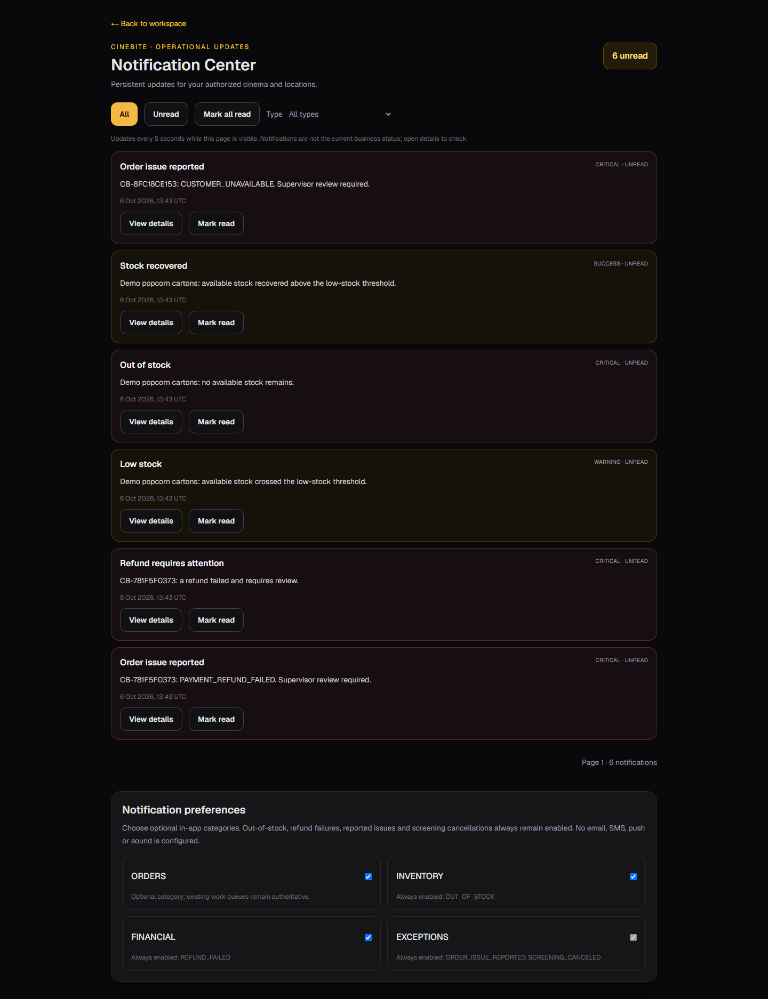
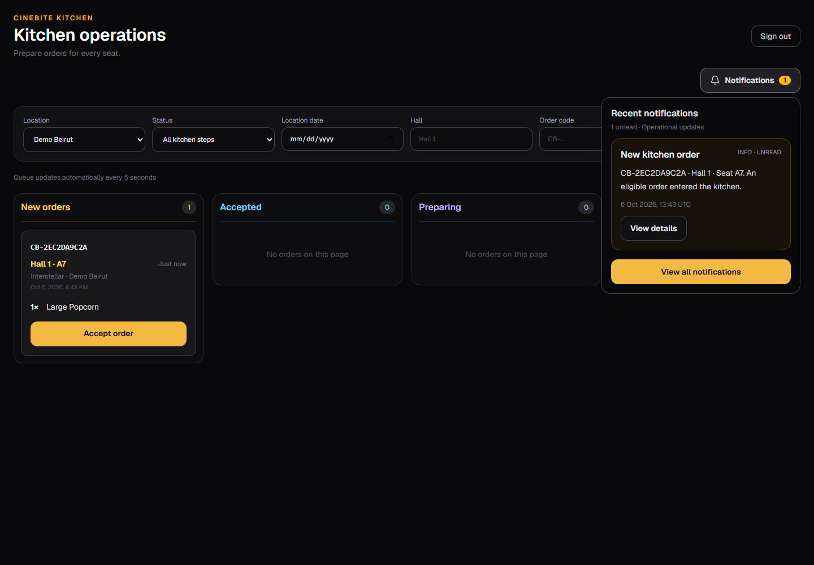
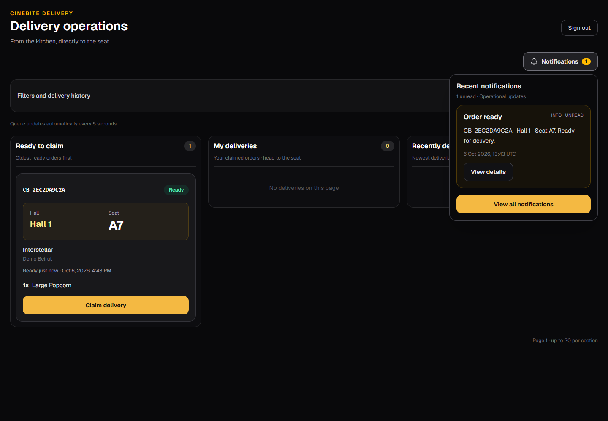
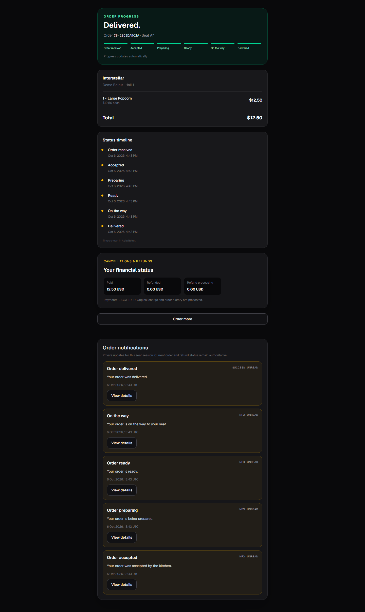
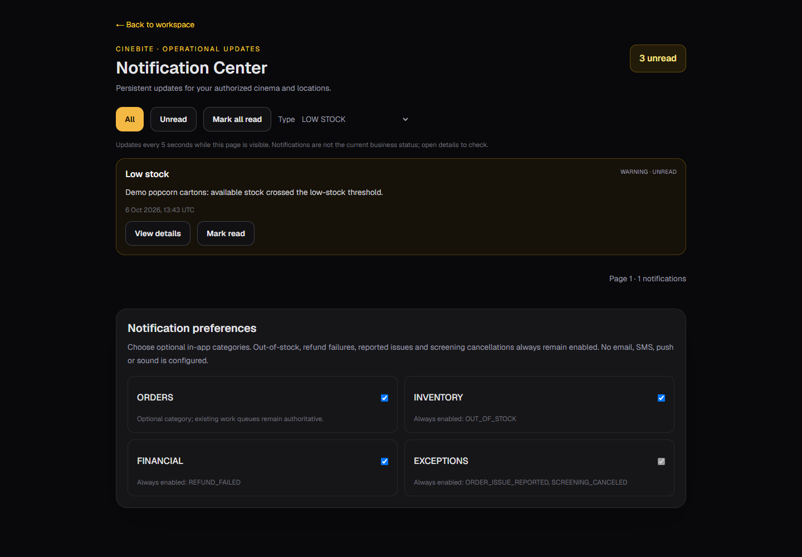
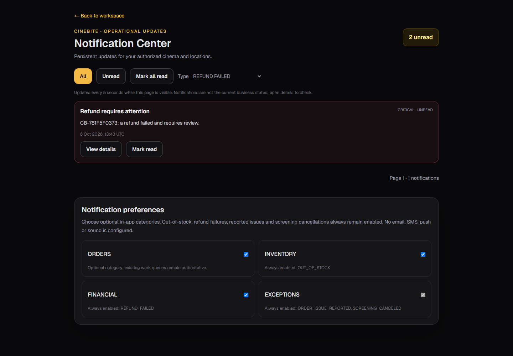
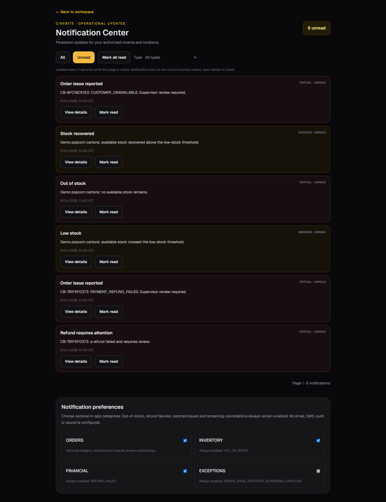
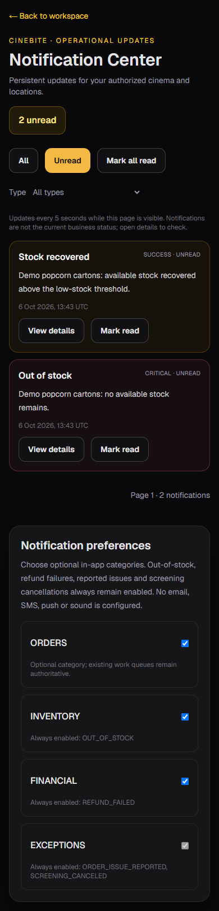

# Phase 17 — Notifications & Alerts

Eight native full-page browser captures of real CineBite UI, using only fictional demo orders in isolated local PostgreSQL, Firebase Auth emulator identities and the explicit payment/refund sandbox. Desktop captures are 1440px wide; the mobile capture is 390px wide. No AI reconstruction, scaling, composite overlays, browser chrome or full-desktop capture is used. The mobile image is captured only after the notification content finishes loading, not during the loading skeleton.

This phase adds durable operational in-app notifications, not marketing or external messaging. Database triggers capture trusted business events transactionally; the outbox processor creates deduplicated, recipient-scoped inbox entries with bounded retries. Staff role/location grants are checked server-side. Customer updates require the owning, unexpired anonymous seat session. Notification preferences cannot suppress critical operational exceptions. The work queues, orders, payments, refunds and inventory remain the business authority.

## Notification center

## Eligible kitchen order

## Ready for delivery

## Private customer order updates

## Low-stock transition

## Refund failure

## Preferences

## Mobile notifications

Public demo order codes and fictional seat labels are shown; no session/QR credentials, real contacts, Firebase tokens, private provider IDs or server secrets are visible. These are actual WARNING/CRITICAL business alerts intentionally showcased, not application errors. External email/SMS/push is not configured or claimed. See [architecture](../../docs/phase-17-architecture.md) and [executed results](../../docs/phase-17-integration-results.json).
